### Hi there! 👋 I'm David Sánchez

🏗️ **Software Architect** | 💻 Backend Developer | ⚡ Python Enthusiast | 🚀 DevOps

  
  

---

## 👨‍💻 About Me

With initial experience as a **Backend Developer**, I currently serve as a **Software Architect**, specializing in **backend** development (Python/Django/FastAPI) and **DevOps**, with experience in consuming and integrating **AI** and **Blockchain** services, as well as developing **conversational chatbots**. Currently exploring **generative AI**, **predictive analysis**, and **web scraping**. Currently learning **Rust**, and pending **AWS Cloud Practitioner** certification.

## 🚀 Technical Experience

### Backend & APIs
- **Python** (Django) - Advanced backend development
- **REST API** - Development and consumption of RESTful services
- **Microservices** and distributed architectures
- **Streamlit** - Rapid development of web applications and interactive dashboards

### DevOps & Cloud
- **Docker / Docker-compose** - Containerization and orchestration
- **Git / GitHub** - Version control with Gitflow methodology
- **CI/CD** - Continuous integration and deployment pipelines
- **AWS** - Amazon Web Services
- **Azure** - Microsoft Azure
- **Heroku** - Cloud application deployment
- System and platform monitoring

### Emerging Technologies
- **Conversational chatbots** - Development of intelligent assistants
- **OpenWebUI** - Web interface for AI models and LLMs
- **Web Scraping** (Selenium, Scrapy) - Automation of data extraction processes
- **Blockchain** - Blockchain services integration

### Other Skills
- Process automation
- Platform maintenance and support
- Software architecture
- **Prompt Engineering** - AI prompt design

## 🌍 Languages

- 🇪🇸 **Spanish** - Native
- 🇬🇧 **English** - Intermediate level

## 📜 Certifications

- 🎯 **Scrum Master Professional Certified** (SMPC)

## 📚 Currently Learning

- 🦀 **Rust** - Continuous learning
- ☁️ **AWS Certification** - In preparation
- ⚙️ **Kubernetes** - Pending

## 💼 Featured Projects

> 🚧 Projects under development - Will be public when stable version is ready

### 💪 Evolveme (WIP)
**Sports training tracking platform**
- Personalized gym routine tracking
- Physical progress recording and analysis
- Performance statistics and metrics system

### 🏀 NBA Data Manager (WIP)
**Sports analysis and prediction system**
- Real-time data collection and processing
- Pre-game predictions and live analysis
- NBA advanced statistics dashboard

### ⚾ MLB Data Manager (Pending)
**Professional baseball analysis platform**
- MLB game predictive analysis
- Historical and real-time data processing
- Machine learning models for sports predictions

---

## 📫 Contact

- 📧 Email: davidsfernandez7@outlook.es
- 💼 LinkedIn: [Connect with me](#)
- 🌐 Portfolio: [Under development](#)

---

⭐️ From [desanchezf](https://github.com/desanchezf)